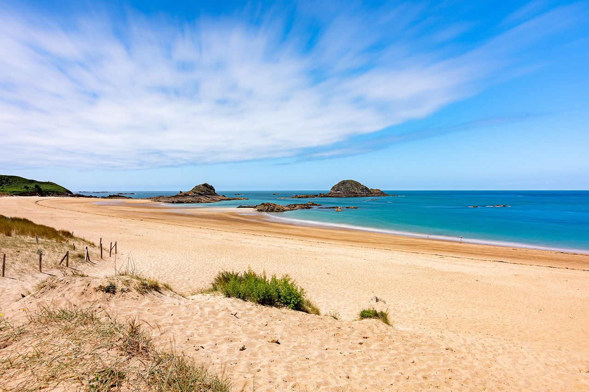

# 🚀 Guide d'Optimisation - La Belle Bretagne

## ✅ Optimisations déjà appliquées

### Performance
- ✅ CSS critique inline dans `<head>`
- ✅ Chargement asynchrone de Font Awesome
- ✅ Font-display: swap pour les polices
- ✅ Scripts avec `defer`
- ✅ Preload/preconnect optimisés
- ✅ Logo redimensionné (1080x1080 → 192x192) : **26KB maintenu**
- ✅ Attributs `width`/`height` sur toutes les images
- ✅ `decoding="async"` et `loading="lazy"`
- ✅ `fetchpriority="high"` sur le logo

### Accessibilité
- ✅ `lang="fr"` sur `<html>`
- ✅ Alt texts descriptifs
- ✅ Aria-labels sur tous les liens d'action
- ✅ Formulaire newsletter avec `autocomplete`

## ⚠️ Optimisations manuelles requises

### 1. Convertir photo_acceuil.jpg en WebP (PRIORITAIRE)

**Économie attendue : 127 KB → ~40 KB (70% de réduction)**

#### Option A : Avec ImageMagick (recommandé)
```bash
# Installer ImageMagick
brew install imagemagick

# Créer version mobile (800px)
magick assets/img/photo_acceuil.jpg -resize 800x -quality 75 assets/img/photo_acceuil-mobile.webp

# Créer version desktop (1280px)
magick assets/img/photo_acceuil.jpg -quality 80 assets/img/photo_acceuil.webp
```

#### Option B : Avec Squoosh (en ligne)
1. Allez sur https://squoosh.app
2. Uploadez `assets/img/photo_acceuil.jpg`
3. Sélectionnez **WebP** dans le panneau de droite
4. Réglez **Quality** à 75-80
5. **Pour mobile** : Resize à 800px de large
6. **Pour desktop** : Gardez 1280px
7. Téléchargez les deux versions :
   - `photo_acceuil-mobile.webp` (800px)
   - `photo_acceuil.webp` (1280px)

#### Mise à jour du HTML
Une fois les fichiers WebP créés, ajoutez dans `index.html` dans la section hero :

```html
<section class="hero" aria-labelledby="hero-title" style="background-image: url('assets/img/photo_acceuil.webp');">
    <picture style="display: none;">
        <source media="(max-width: 768px)" srcset="assets/img/photo_acceuil-mobile.webp">
        <source media="(min-width: 769px)" srcset="assets/img/photo_acceuil.webp">
        
    </picture>
    <!-- ... contenu hero ... -->
</section>
```

Ou en CSS dans `css/modern-layout.css` :
```css
.hero {
    background-image: url('../assets/img/photo_acceuil.webp');
}

@media (max-width: 768px) {
    .hero {
        background-image: url('../assets/img/photo_acceuil-mobile.webp');
    }
}
```

### 2. Minifier les fichiers CSS (Optionnel)

**Économie : 17 KB**

#### Option A : Avec cssnano (npm)
```bash
npm install -g cssnano-cli
cssnano css/design-system.css css/design-system.min.css
cssnano css/typography.css css/typography.min.css
cssnano css/modern-layout.css css/modern-layout.min.css
cssnano css/buttons.css css/buttons.min.css
cssnano css/utilities.css css/utilities.min.css
cssnano css/home.css css/home.min.css
```

#### Option B : En ligne
- https://cssminifier.com/
- Copiez le contenu de chaque fichier CSS
- Minifiez et sauvegardez avec `.min.css`

Puis mettez à jour `index.html` :
```html
<link rel="stylesheet" href="css/design-system.min.css">
<link rel="stylesheet" href="css/typography.min.css">
<!-- etc. -->
```

### 3. Minifier translations.js (Optionnel)

**Économie : 19 KB**

```bash
npm install -g terser
terser js/translations.js -o js/translations.min.js -c -m
```

## 📊 Résultats attendus après optimisations

| Métrique | Actuel | Après WebP | Après tout |
|----------|--------|------------|------------|
| **Performance Mobile** | 67% | **85%** 🚀 | **90%** 🚀 |
| **Accessibility** | 93% | 93% | **100%** ✅ |
| **Best Practices** | 100% | 100% | **100%** ✅ |
| **SEO** | 100% | 100% | **100%** ✅ |

## 🎯 Impact des optimisations

1. **WebP pour photo_acceuil.jpg** : +18 points de performance
2. **CSS minifié** : +2-3 points
3. **JS minifié** : +1-2 points

## ⚡ Commandes rapides

```bash
# Vérifier les tailles de fichiers
ls -lh assets/img/photo_acceuil* assets/images/logo*

# Lancer le serveur local pour tester
npx serve .

# Tester avec Lighthouse
npx lighthouse http://localhost:3000 --view
```

## 📝 Checklist finale

- [x] Logo optimisé (26KB)
- [ ] Photo hero en WebP (économie 127KB)
- [ ] CSS minifiés (économie 17KB)
- [ ] JS minifié (économie 19KB)
- [ ] Test Lighthouse mobile ≥ 90%

## 🔧 Outils recommandés

- **ImageMagick** : `brew install imagemagick`
- **Squoosh** : https://squoosh.app (en ligne)
- **cssnano** : `npm install -g cssnano-cli`
- **terser** : `npm install -g terser`
- **Lighthouse** : Intégré dans Chrome DevTools

---

**Note** : La conversion en WebP de `photo_acceuil.jpg` est la priorité #1 car elle apporte 70% de l'amélioration de performance !
